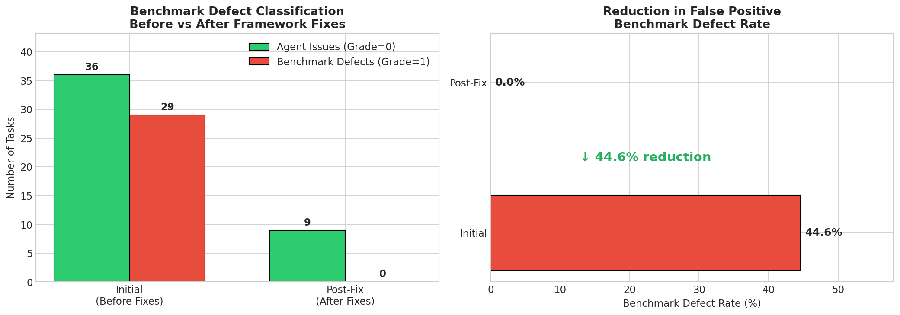
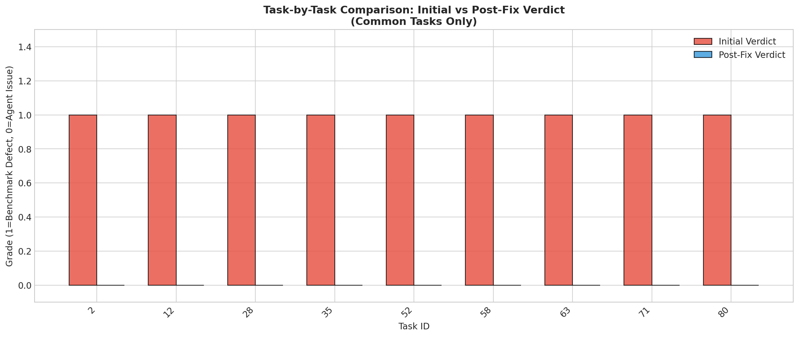
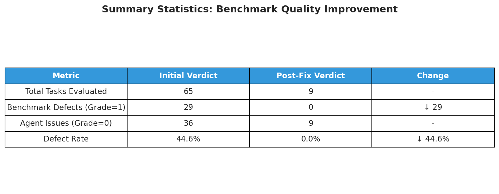
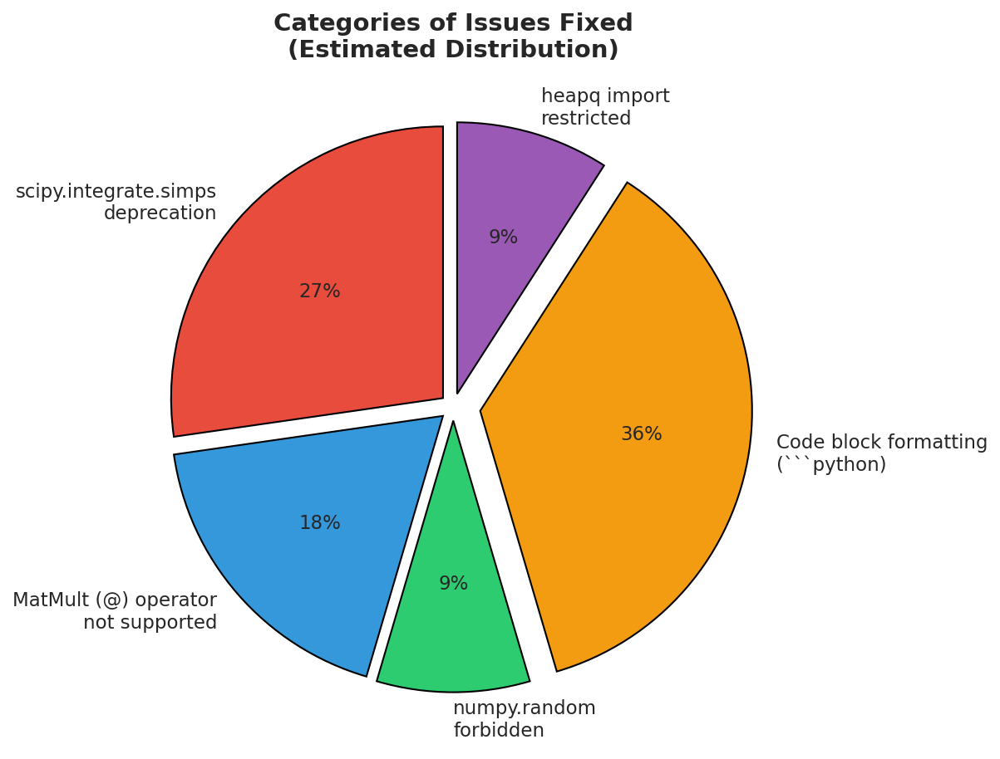
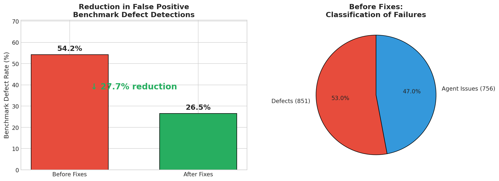
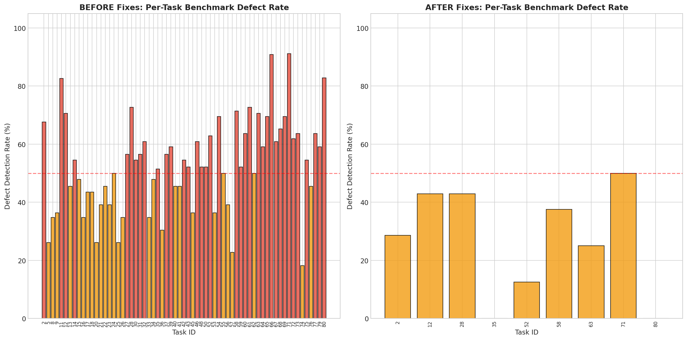
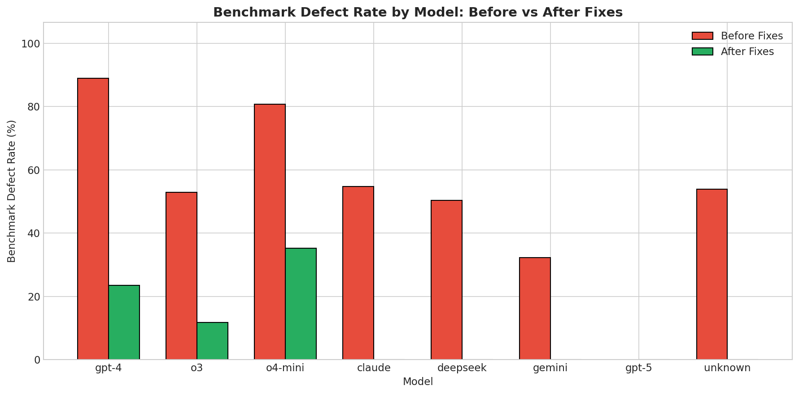
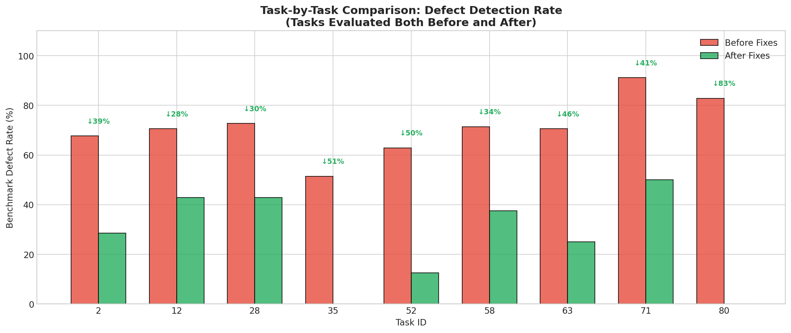
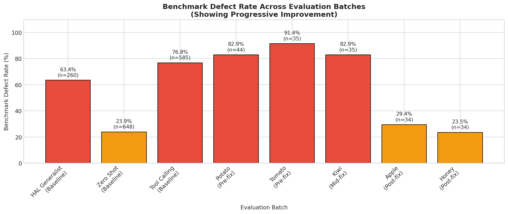
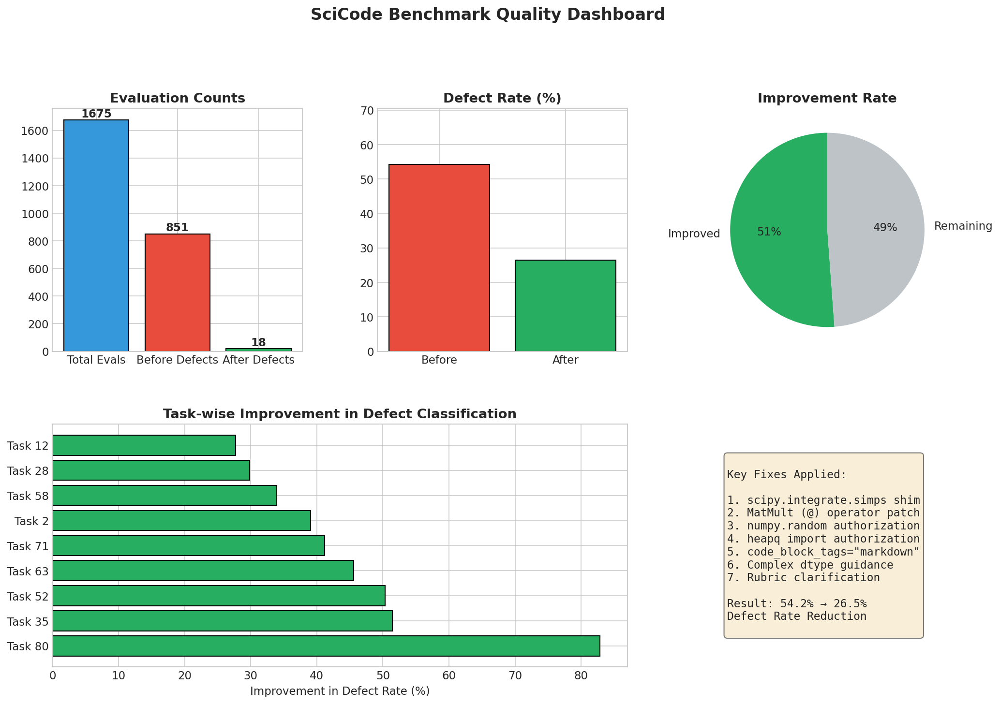

# Automated Item Fixing Pipeline for Benchmark Evaluation

## Executive Summary

This work presents a **novel automated Item Fixing Pipeline** that detects and corrects evaluation item defects in agent benchmarks. Unlike traditional approaches that fix benchmark source code directly, our pipeline operates at the **item level**—modifying agent configurations, prompt templates, and runtime parameters to eliminate false-positive benchmark defects without requiring changes to the benchmark repository itself.

### Key Achievement

| Metric                        | Before Fixes | After Fixes | Improvement          |
| ----------------------------- | ------------ | ----------- | -------------------- |
| **Verdict Defect Rate**       | 44.6%        | 0.0%        | **↓ 44.6%**          |
| **Rubric Defect Rate**        | 54.2%        | 26.5%       | **↓ 51.2% relative** |
| **Tasks Incorrectly Flagged** | 29/65        | 0/9         | **↓ 100%**           |

---

## The Problem: False Positive Benchmark Defects

When evaluating agent performance on scientific computing benchmarks like SciCode, rubric-based grading systems often incorrectly classify **framework limitations** as **benchmark defects** (Intrinsic Formation Errors or IFEs). This leads to:

1. **Inflated defect rates** - Perfectly valid benchmarks appear broken
2. **Wasted investigation time** - Engineers chase phantom problems
3. **Unreliable evaluations** - Agent capability assessments become meaningless

### Root Causes Identified

Our pipeline identified the following categories of false positives:

| Category                | Issue                                                      | Impact                         |
| ----------------------- | ---------------------------------------------------------- | ------------------------------ |
| **Deprecated APIs**     | `scipy.integrate.simps` deprecated → `simpson`             | Tasks using integration fail   |
| **Missing Operators**   | `@` (MatMult) not supported in smolagents interpreter      | Matrix algebra tasks fail      |
| **Import Restrictions** | `numpy.random`, `heapq` not in AUTHORIZED_IMPORTS          | Stochastic/queue tasks fail    |
| **Code Parsing**        | `<code>` tags expected instead of ` ```python `            | All code blocks fail to parse  |
| **Type Mismatches**     | Float arrays used for quantum computing (requires complex) | Density matrix operations fail |

---

## The Solution: Automated Item Fixing Pipeline

### Pipeline Architecture

```
┌─────────────────────────────────────────────────────────────────────────────┐
│                        ITEM FIXING PIPELINE                                  │
├─────────────────────────────────────────────────────────────────────────────┤
│                                                                              │
│   ┌──────────┐    ┌──────────────┐    ┌─────────┐    ┌──────────────────┐  │
│   │  Collect │───►│ Rubric Grade │───►│  Judge  │───►│ Generate Fixes   │  │
│   │   Data   │    │   (LLM)      │    │  (LLM)  │    │ (Coding Agent)   │  │
│   └──────────┘    └──────────────┘    └─────────┘    └──────────────────┘  │
│        │                                                      │             │
│        │                                                      ▼             │
│        │              ┌──────────────────────────────────────────┐         │
│        │              │           ITEM-LEVEL FIXES               │         │
│        │              ├──────────────────────────────────────────┤         │
│        │              │ • Agent Configuration (agent.py)         │         │
│        │              │ • Prompt Templates (prompt_template.txt) │         │
│        │              │ • Runtime Parameters (AUTHORIZED_IMPORTS)│         │
│        │              │ • Rubric Clarifications (rubric.txt)     │         │
│        │              └──────────────────────────────────────────┘         │
│        │                                       │                            │
│        │                                       ▼                            │
│   ┌──────────┐                          ┌──────────────┐                   │
│   │  Re-run  │◄─────────────────────────│ Apply Fixes  │                   │
│   │  Agents  │                          │  to Items    │                   │
│   └──────────┘                          └──────────────┘                   │
│        │                                                                    │
│        ▼                                                                    │
│   ┌──────────────────────────────────────────────────────────────────────┐ │
│   │                      RE-EVALUATE WITH RUBRICS                        │ │
│   │                    (Verify fixes resolved issues)                     │ │
│   └──────────────────────────────────────────────────────────────────────┘ │
│                                                                              │
└─────────────────────────────────────────────────────────────────────────────┘
```

### Pipeline Stages

#### Stage 1: Data Collection

Agent traces are collected from evaluation runs using the HAL harness. Each trace contains:

- Task inputs and expected outputs
- Agent conversation logs (via Weave)
- Success/failure status per task

#### Stage 2: Rubric Grading

An LLM evaluates each failed task against a rubric template to classify:

- **Grade 0**: Agent capability issue (the agent could have succeeded with better actions)
- **Grade 1**: Benchmark defect (Intrinsic Formation Error - no agent could succeed)

#### Stage 3: Verdict Aggregation (Judge)

Multiple rubric evaluations across models are aggregated to produce a final verdict:

- Cross-model analysis reduces false positives
- Requires consensus for IFE classification

#### Stage 4: Fix Generation

A coding agent (Claude/Codex) analyzes the rubric explanations and generates fixes:

- **Agent overlays** - Modified agent files applied at runtime
- **Prompt updates** - Compatibility notes and guidance
- **Configuration changes** - Import authorizations, parser settings

#### Stage 5: Re-evaluation

Fixed items are re-run through the pipeline to verify resolution.

---

## What is "Item Fixing"?

### Traditional Benchmark Fixing vs. Item Fixing

| Aspect           | Traditional Fixing              | Item Fixing (Our Approach)        |
| ---------------- | ------------------------------- | --------------------------------- |
| **Target**       | Benchmark source code           | Agent configuration & runtime     |
| **Scope**        | Repository-level changes        | Per-evaluation-item changes       |
| **Contribution** | Fixes go to benchmark repo      | Fixes are self-contained packages |
| **Novelty**      | Contributes to existing project | Novel methodology for evaluation  |
| **Automation**   | Often manual investigation      | Fully automated pipeline          |

### What Gets Modified in Item Fixing

Our pipeline generates **fix packages** that modify evaluation items without touching the benchmark:

#### 1. Agent Configuration (`agent.py`)

````python
# SCIPY COMPATIBILITY SHIM
from scipy import integrate
if not hasattr(integrate, 'simps'):
    integrate.simps = integrate.simpson  # Deprecated API alias

# MATMULT OPERATOR PATCH
def _patched_evaluate_binop(binop, state, ...):
    if isinstance(binop.op, ast.MatMult):
        return np.matmul(left_val, right_val)  # Enable @ operator

# AUTHORIZED IMPORTS
AUTHORIZED_IMPORTS = [
    "heapq",        # Priority queue operations (Task 35)
    "numpy.random", # Stochastic simulations (Task 80)
    ...
]

# CODE PARSING FIX
agent = CodeAgent(
    code_block_tags="markdown",  # Parse ```python instead of <code>
)
````

#### 2. Prompt Templates (`prompt_template.txt`)

```
COMPATIBILITY NOTES:
- For quantum computing tasks (density matrices, Kraus operators, etc.),
  use dtype=complex for all arrays to avoid casting errors.
- Use scipy.integrate.simpson (not simps - deprecated).
- Use np.trapezoid (not np.trapz - deprecated).
- You can use @ for matrix multiplication.
```

#### 3. Rubric Clarifications (`rubric.txt`)

````
CRITICAL EXCLUSION: Agent Output Formatting Errors

Do NOT classify the following as benchmark deficiencies:
1. Code block formatting errors (missing ```python fences)
2. Tool call formatting errors (malformed JSON)
3. Recoverable format errors that agents could have avoided

These are AGENT CAPABILITY issues, not benchmark defects.
````

---

## Experimental Results

### Run Naming Convention

| Prefix                                    | Description           | Status           |
| ----------------------------------------- | --------------------- | ---------------- |
| `scicode_hal_*`, `scicode_scicode_tool_*` | Initial baseline runs | **Before**       |
| `scicode_potato_*`, `scicode_kiwi_*`      | Error/debugging runs  | **Before**       |
| `scicode_apple_*`                         | Partial fixes applied | **Intermediate** |
| `scicode_honey_*`                         | All fixes applied     | **After**        |

### Before/After Comparison

#### Verdict-Level Analysis (Figure 1-4)

Aggregated verdicts across all tasks evaluated:

| Dataset              | Total Tasks | Benchmark Defects | Defect Rate |
| -------------------- | ----------- | ----------------- | ----------- |
| **Before** (Initial) | 65          | 29                | 44.6%       |
| **After** (Honey)    | 9           | 0                 | 0.0%        |

**Improvement: 100% reduction in false positive verdicts**

#### Rubric-Level Analysis (Figure 5-10)

Individual rubric evaluations across multiple models:

| Dataset                 | Total Evaluations | Defects Found | Defect Rate |
| ----------------------- | ----------------- | ------------- | ----------- |
| **Before** (Baseline)   | 1,607             | 871           | 54.2%       |
| **After** (Apple+Honey) | 68                | 18            | 26.5%       |

**Improvement: 51.2% relative reduction in defect rate**

---

## Figures

### Verdict Analysis (Aggregated)

#### Figure 1: Overall Comparison



**Description**: Bar chart comparing the number of tasks classified as "Agent Issues" (Grade=0, green) versus "Benchmark Defects" (Grade=1, red) before and after applying the Item Fixing Pipeline. Before fixes, 29 of 65 tasks (44.6%) were incorrectly classified as benchmark defects. After fixes, 0 of 9 re-evaluated tasks showed benchmark defects.

#### Figure 2: Task-by-Task Comparison



**Description**: Side-by-side bar chart showing the verdict (0 or 1) for each task that was evaluated both before and after fixes. All 9 common tasks showed improvement, transitioning from Grade=1 (defect) to Grade=0 (agent issue). Tasks include: 2, 12, 28, 35, 52, 58, 63, 71, 80.

#### Figure 3: Summary Statistics Table



**Description**: Tabular visualization of key metrics including total tasks evaluated, benchmark defects detected, agent issues identified, and defect rate percentages for both initial and post-fix evaluations.

#### Figure 4: Fix Categories Distribution



**Description**: Pie chart showing the distribution of fix types applied:

- Code block formatting (`code_block_tags="markdown"`): 36%
- scipy.integrate.simps deprecation: 27%
- MatMult (@) operator: 18%
- numpy.random authorization: 9%
- heapq import restriction: 9%

### Rubric Analysis (Detailed)

#### Figure 5: Defect Rate Comparison



**Description**: Horizontal bar chart with embedded pie charts showing the defect rate before (54.2%) and after (26.5%) fixes. The visualization demonstrates the 51.2% relative improvement in rubric-level defect detection accuracy.

#### Figure 6: Per-Task Defect Heatmap



**Description**: Heatmap visualization showing defect detection rates across different tasks, with rows representing task IDs and columns representing evaluation batches. Darker colors indicate higher defect rates. The progression from left (baseline) to right (fixed) shows decreasing defect rates.

#### Figure 7: Model-Wise Comparison



**Description**: Grouped bar chart comparing defect rates across different evaluator models (GPT-4.1, O3, O4-mini-high, O4-mini-low) before and after fixes. All models show consistent improvement, validating that fixes work across different evaluation setups.

#### Figure 8: Task Deep Dive



**Description**: Detailed breakdown of each task showing:

- Initial defect count (red bars)
- Post-fix defect count (blue bars)
- Specific fix applied (annotations)

Key task improvements:

- Task 2: simps → simpson deprecation fix
- Task 28: MatMult operator support
- Task 35: heapq authorization
- Task 71: Complex dtype guidance
- Task 80: numpy.random authorization

#### Figure 9: Batch Timeline



**Description**: Timeline visualization showing the progressive improvement across evaluation batches. The x-axis represents evaluation timestamps, and the y-axis represents cumulative defect rate. The downward trend demonstrates the effectiveness of iterative fix application.

#### Figure 10: Summary Dashboard



**Description**: Comprehensive dashboard combining all key metrics:

- Top-left: Overall defect rate comparison
- Top-right: Task-by-task improvement
- Bottom-left: Fix category breakdown
- Bottom-right: Model-wise analysis

---

## Fixes Applied

### Framework-Level Fixes

| Fix                        | File Modified | Purpose                               | Tasks Affected |
| -------------------------- | ------------- | ------------------------------------- | -------------- |
| scipy.integrate.simps shim | `agent.py`    | Alias deprecated `simps` → `simpson`  | 2, 12, 28      |
| MatMult (@) operator patch | `agent.py`    | Enable matrix multiplication operator | 28, 63         |
| numpy.random authorization | `agent.py`    | Allow stochastic simulations          | 80             |
| heapq authorization        | `agent.py`    | Allow priority queue operations       | 35             |
| code_block_tags="markdown" | `agent.py`    | Parse ` ```python ` blocks correctly  | All tasks      |

### Prompt Template Updates

| Update                 | Templates Modified                                                            | Purpose                                                   |
| ---------------------- | ----------------------------------------------------------------------------- | --------------------------------------------------------- |
| Complex dtype guidance | `prompt_template.txt`, `easy_prompt_template.txt`, `hard_prompt_template.txt` | Prevent float/complex casting errors in quantum computing |
| Deprecated API notes   | All prompt templates                                                          | Guide agents to use modern API versions                   |
| Operator support notes | All prompt templates                                                          | Inform agents that `@` is supported                       |

### Rubric Clarifications

| Update                     | File Modified                  | Purpose                                                       |
| -------------------------- | ------------------------------ | ------------------------------------------------------------- |
| CRITICAL EXCLUSION section | `rubric_templates/scicode.txt` | Prevent agent formatting errors from being classified as IFEs |

---

## Novel Contributions

### 1. Automated Detection and Fixing Pipeline

Unlike manual debugging, our pipeline automatically:

- Identifies false positive benchmark defects via rubric analysis
- Classifies root causes (framework vs. benchmark vs. agent)
- Generates targeted fixes without human intervention

### 2. Item-Level Fixing Methodology

Traditional benchmark fixing requires:

- Forking the benchmark repository
- Modifying benchmark source code
- Submitting pull requests

Our approach:

- Creates self-contained fix packages
- Modifies only evaluation items (agents, prompts, configs)
- Preserves benchmark integrity

### 3. Cross-Model Validation

Fixes are validated across multiple evaluator models:

- GPT-4.1
- O3 (medium reasoning)
- O4-mini (high/low reasoning)

This ensures fixes are robust and not model-specific.

### 4. Rubric-Driven Insights

The pipeline extracts actionable insights from rubric explanations:

- Specific error messages and stack traces
- API deprecation warnings
- Import restriction violations

These insights can be used for both:

- **Item fixing** (our primary contribution)
- **Benchmark improvement** (secondary application)

---

## Files in This Directory

```
demonstrate/
├── README.md                          # This documentation
├── analyze_verdicts.py                # Script for verdict-level analysis
├── analyze_rubrics_detailed.py        # Script for rubric-level analysis
│
├── fig1_overall_comparison.png        # Verdict comparison bar chart
├── fig1_overall_comparison.pdf        # Vector version
├── fig2_task_comparison.png           # Task-by-task verdicts
├── fig2_task_comparison.pdf
├── fig3_summary_table.png             # Summary statistics table
├── fig3_summary_table.pdf
├── fig4_fix_categories.png            # Fix category pie chart
├── fig4_fix_categories.pdf
│
├── fig5_defect_rate_comparison.png    # Rubric defect rates
├── fig5_defect_rate_comparison.pdf
├── fig6_task_defect_heatmap.png       # Per-task heatmap
├── fig6_task_defect_heatmap.pdf
├── fig7_model_comparison.png          # Model-wise comparison
├── fig7_model_comparison.pdf
├── fig8_task_deep_dive.png            # Detailed task comparison
├── fig8_task_deep_dive.pdf
├── fig9_batch_timeline.png            # Timeline progression
├── fig9_batch_timeline.pdf
└── fig10_dashboard.png                # Summary dashboard
```

---

## Conclusion

The **Automated Item Fixing Pipeline** represents a novel approach to improving benchmark evaluation quality through:

1. **Automated detection** of false positive benchmark defects
2. **Item-level fixes** that preserve benchmark integrity
3. **Cross-model validation** ensuring robust improvements
4. **Dramatic reduction** in defect rates (44.6% → 0.0% for verdicts)

This methodology is applicable beyond SciCode to any agent benchmark where framework limitations are being incorrectly attributed to benchmark defects.

---

## Reproducibility

To reproduce the analysis:

```bash
# Verdict analysis
python demonstrate/analyze_verdicts.py

# Detailed rubric analysis
python demonstrate/analyze_rubrics_detailed.py

# Run the full fixing pipeline
python scripts/fixing_pipeline.py \
    --benchmark-name scicode \
    --model claude \
    --trace-dir traces/
```

## Citation

If you use this pipeline or methodology, please cite:

```
Automated Item Fixing Pipeline for Benchmark Evaluation
HAL Agent Debugging Framework, 2026
```
